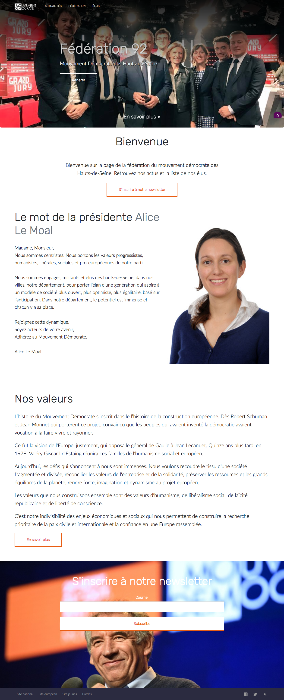

  

Pardon my french

# Federal

Un template jekyll pour présenter une équipe, notamment utile pour une fédération de parti politique ou une liste électorale.

Federal est un fork de [Frisco](https://github.com/CloudCannon/frisco-jekyll-template).

## Features

* Integration Medium 
* Présentation du staff 
* Formulaire de contact 
* Mailchimp 
* SEO tags 
* Google Analytics 

## Paramétrer

1. Ajouter les détails du site et de l'auteur dans `_config.yml`.
2. Ajouter ID Google Analytics également dans `_config.yml`.

## Forker

Federal a été développé via [Jekyll](http://jekyllrb.com/) version 3.3.1, et supportera probablement les versions ultérieures.

Les dépendances s'installent avec [Bundler](http://bundler.io/) :

~~~bash
$ bundle install
~~~

On lance ensuite la commande `jekyll` via Bundler pour être sûr d'être dans la bonne version :

~~~bash
$ bundle exec jekyll serve
~~~

## Ajouts et édition

Plus d'infos sur [le wiki](https://github.com/jeunes-democrates/modem92/wiki).

### Formulaire de contact

* Utiliser par exemple [FormSpree](https://formspree.io/).

### Staff

* Créer un fichier .md par personne dans le dossier `staff`. Ils s'afficheront par ordre alphabétique.
